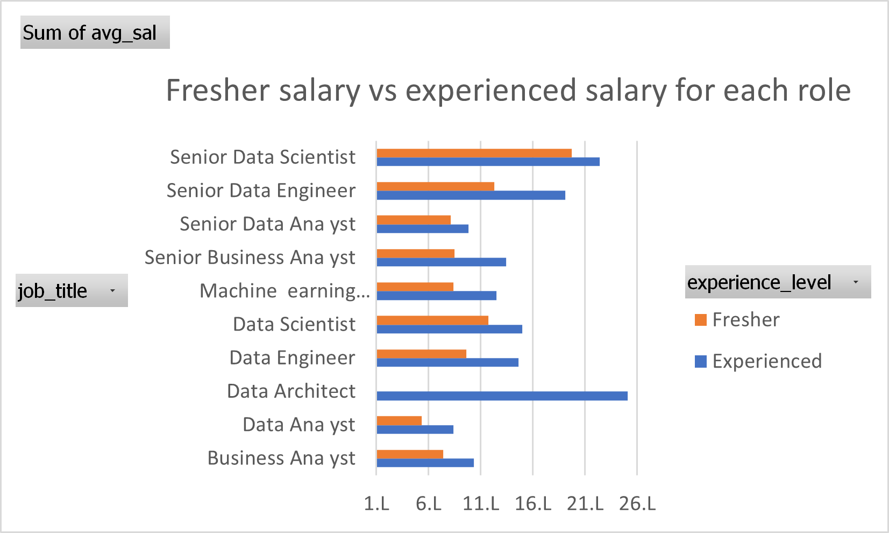
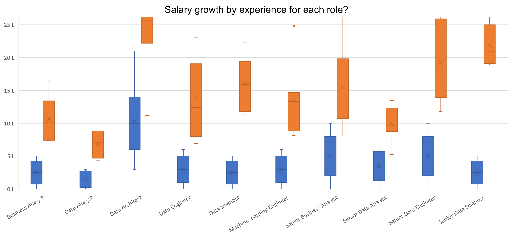
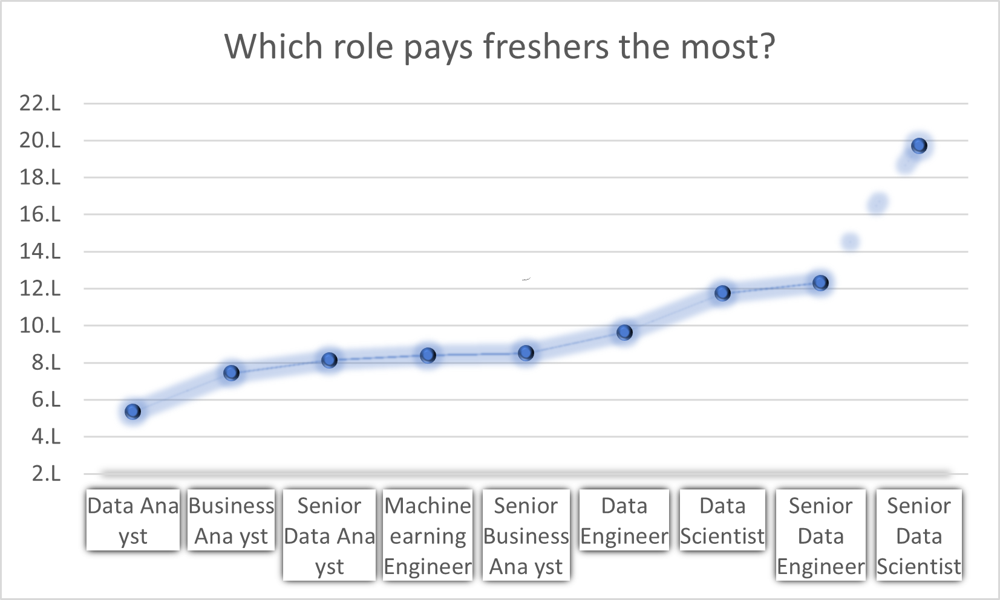
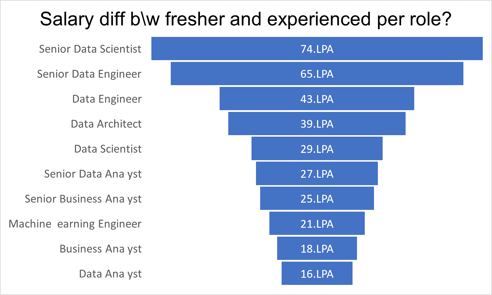

# Job Salary Analysis (SQL Project)

## Project Overview
This project analyzes job salary trends in India for Data Science roles using PostgreSQL. The dataset downloaded from [kaggel](https://www.kaggle.com/datasets/madhurpant/data-science-jobs-in-indiacontains) company-wise salary statistics, experience requirements, and salary distribution.

## Tools Used
- PostgreSQL
- Visual Studio Code
- Microsoft Excel
- Git & GitHub

## Dataset Columns
- `company_name` → Company offering the role
- `job_title` → Role title
- `min_experience` → Minimum required experience
- `avg_sal` → Average salary (LPA)
- `min_sal` → Minimum salary (LPA)
- `max_sal` → Maximum salary (LPA)
- `num_of_sal` → Number of salary records

## Database Schema
```sql
CREATE TABLE job_salary (
    company_name TEXT,
    job_title TEXT,
    min_experience INT,
    avg_sal NUMERIC,
    min_sal NUMERIC,
    max_sal NUMERIC,
    num_of_sal INT
);
```

## Data Import
```sql
\copy job_salary FROM 'csv_files/jobs_India.csv'
WITH (FORMAT csv, HEADER true, DELIMITER ',', ENCODING 'UTF8');
```

## Analysis Questions

### 1. Average Salary by Role
```sql
SELECT job_title, ROUND(AVG(avg_sal),2)
FROM job_salary
GROUP BY job_title;
```

### Result
- Identified average salary for each job role.
- Data Scientist roles showed strong salary growth with experience.

---

### 2. Fresher vs Experienced Salary
```sql
SELECT job_title,
CASE WHEN min_experience <= 1 THEN 'Fresher'
ELSE 'Experienced' END,
ROUND(AVG(avg_sal),2)
FROM job_salary
GROUP BY job_title, min_experience;
```

### Result
- Freshers had lower average salaries.
- Experienced professionals earned significantly higher salaries.

---

### 3. Highest Paying Companies
```sql
SELECT company_name, avg_sal
FROM job_salary
ORDER BY avg_sal DESC
LIMIT 10;
```

### Result
- Amazon and product-based companies offered higher salaries.
- Service-based companies showed moderate salary ranges.

---

## Key Insights
- Salary increases with experience.
- Product-based companies generally pay more than service-based companies.
- Data Scientist roles have wide salary ranges across companies.
- Fresher salaries are concentrated in lower bands.

## Charts to Add
Add screenshots here:

### Salary by Company


### Experience vs  Fresher Salary


### Role-wise Average Salary


### Hihger Salary Fresher


### Diff Salary



## Conclusion
The analysis helps understand salary trends, company compensation patterns, and experience-based salary growth in the Data Science domain.

